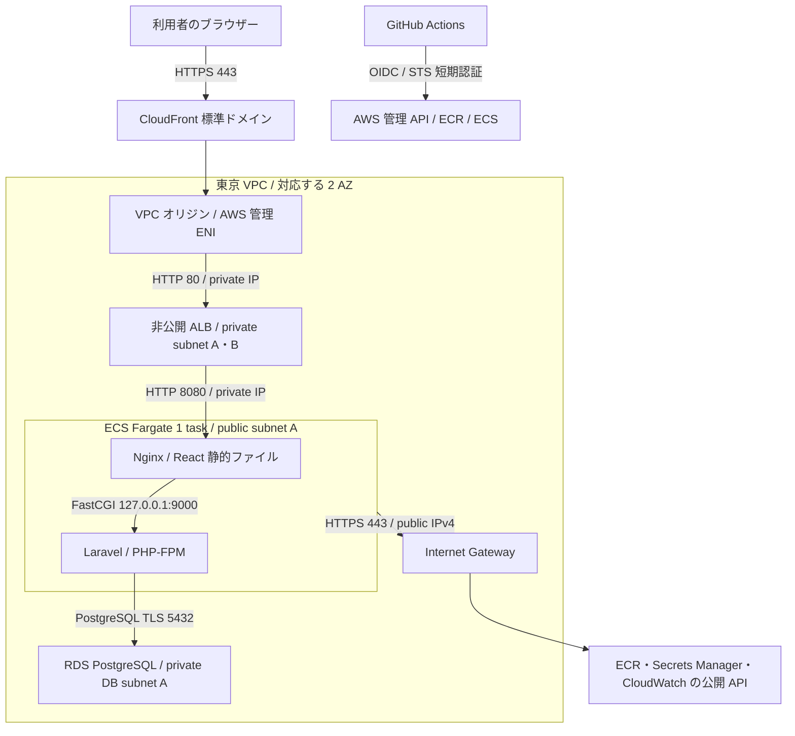

# AWS 基本設計案

## 決定事項と提案の境界

ユーザー決定：題材は社内IT依頼・改善管理サービス。React + TypeScript + Vite、Laravel、PostgreSQL、Docker、ECS、Terraform、GitHub Actionsを使用します。AWS月額予算は3,000円、構築から撤去まで月60時間程度、公開は事前案内期間のみ。独自ドメインは所有していません。シフトレフト、必要最小限のベースイメージ、非root実行、マルチステージビルドを重視します。

以下は**成立条件を調査した基本設計の提案**です。東京リージョン、CloudFront 従量課金・標準ドメイン、VPC オリジン、非公開 ALB、ECS Fargate、非公開 Single-AZ RDS、NAT Gateway・Redis なしという構成は、AWS 実機での検証・採用確定ではありません。機能・権限の詳細も [requirements.md](requirements.md) のレビュー対象のままです。

公式仕様の確認日：**2026-09-21**。Terraform AWS Provider **v6.65.0** の文書を確認しました。これは調査基準であり、導入済みバージョンではありません。実装時に Terraform 本体、Provider、Laravel / PHP / Node / PostgreSQL 等の対応バージョンを固定し、lock ファイルを管理します。費用は [costs.md](costs.md) を参照してください。

## 今回反映した運用前提（2026-09-22）

- 架空データ専用の期間限定デモ。内部 HTTP と標準証明書の TLS 制約は下記のデモ限定例外として扱う。
- 月60時間の目安は構築・検証6時間、公開48時間、閉鎖・保存・撤去等6時間。初月は検証に応じ公開を短縮する。
- 同じ公開期間の再デプロイはデータ保持、次回公開は新規の空DBに初期データを投入。snapshot復元は同期間の障害対応・隔離検証用とする。
- snapshotは取得後7日間・通常最新1世代。復元検証中だけ期限内で一時併存し、コピーや復元で元の期限を延ばさない。アプリログ7日・アクセスログ30日。バックアップ費用枠は当面維持。
- 公開終了時はデモ資格情報・セッションを失効。削除・結果確認は作成者が担当。秘密情報の誤投入は保存期限を待たず対応する。

これらは今回ユーザーが指定した設計前提です。業務詳細の採否や AWS 構成の実機検証完了を意味しません。具体的な [DB と管理手順](database.md)、[API](api.md)、[画面](screens.md)、[対応表](design-review.md)を追加しました。

## 構成・通信経路（提案）

CloudFront → ALB → タスクは private IP の経路です。ECS の public IPv4 はイメージ取得・秘密情報注入・ログ送信などの外向き接続用で、外部からの直接受信は許可しません。ALB のターゲットは `ip`、ECS は `awsvpc` とします。同一タスクの Nginx と PHP-FPM は localhost で通信します。[ECS の外向き通信仕様](https://docs.aws.amazon.com/AmazonECS/latest/developerguide/networking-outbound.html)を前提に、`assign_public_ip=true` と IGW への経路を両方用意します。

Nginx が Vite の成果物を配信し、`/api/*`、`/login`、`/logout`、`/sanctum/csrf-cookie` は Laravel へ渡す案です。SPA の画面パスだけを index.html にフォールバックし、API の 401 / 403 / 404 / 419 / 422 を HTML の成功応答に変換しません。React に AWS 資格情報・DB 情報を埋め込みません。`VITE_*` は利用者へ配信される設定として扱います。

## サブネット・配置

CIDR は重複のない例であり、実装前に決めます。AZ 名の末尾ではなく AZ ID を確認し、CloudFront VPC オリジン非対応の **`apne1-az3` を避ける**案です。

| 配置 | CIDR 例 | ルート・役割 |
| --- | --- | --- |
| VPC | 10.20.0.0/16 | DNS 解決・DNS ホスト名を有効化、IGW をアタッチ |
| public A / B | 10.20.0.0/24、10.20.1.0/24 | `0.0.0.0/0 → IGW`。タスクは初期案では A に 1 個。B は配置変更用 |
| private ALB A / B | 10.20.10.0/24、10.20.11.0/24 | local 経路のみ。ALB と CloudFront 管理 ENI。IGW / NAT へのデフォルト経路なし |
| private DB A / B | 10.20.20.0/24、10.20.21.0/24 | local 経路のみ。DB subnet group は 2 AZ、Single-AZ DB の実体は A |

ALB は別々の AZ の最低 2 サブネットが必要で、各サブネットは /27 以上・空き IP 8 個以上を確保します。DB subnet group も Single-AZ であっても 2 AZ を用意します。タスクと DB を通常同じ AZ に置き通信費を抑えますが、単一タスク・Single-AZ のため高可用構成ではありません。サブネットが 2 AZ にあるだけでアプリが冗長化されるわけではありません。[ALB の要件](https://docs.aws.amazon.com/elasticloadbalancing/latest/application/application-load-balancers.html)、[RDS の VPC 要件](https://docs.aws.amazon.com/AmazonRDS/latest/UserGuide/USER_VPC.WorkingWithRDSInstanceinaVPC.html)

## VPC オリジンの成立条件と Terraform の扱い

| 確認項目 | 仕様と設計への反映 |
| --- | --- |
| 対象とネットワーク | 東京は対応、ただし前記 AZ ID に例外あり。Active 状態の内部 ALB、IGW のアタッチ、管理 ENI 用の空き private IPv4 が必要。VPC オリジンの通信自体は IGW を使わない |
| セキュリティグループ | 作成時は ALB に CloudFront origin-facing managed prefix list からの受信を許可。その後、AWS が作る `CloudFront-VPCOrigins-Service-SG` 系の SG を参照する受信ルールへ絞る。AWS 管理 SG を自作・変更しない |
| 非対応・制約 | gRPC、Lambda@Edge の origin request / response トリガーは使わない。NACL の inbound をこの経路の主な防御にせず SG で制限。戻り方向の NACL は ephemeral port を妨げない |
| Provider リソース | `aws_cloudfront_vpc_origin.vpc_origin_endpoint_config` に ALB ARN、名前、HTTP / HTTPS ポート、protocol policy、SSL protocols を設定する。HTTP 案でも Provider 必須の `https_port` と `origin_ssl_protocols` を省略しない |
| HTTP 案の設定値 | `http_port=80`、`https_port=443`、`origin_protocol_policy="http-only"`、SSL protocols は TLSv1.2 を設定する案。443 の値を書くだけで ALB の HTTPS listener が作られるわけではない |
| Distribution 側 | `origin.domain_name` は内部 ALB の DNS 名、`origin.vpc_origin_config.vpc_origin_id` は上の ID を参照。同じ origin に public custom origin の設定を併記しない |
| 依存関係 | ALB・listener を作成してから VPC origin、その Deployed 後に Distribution へ関連付ける。管理 SG は VPC origin 作成後に data source で VPC ID と AWS 管理名を照合して取得する案。v6.65.0 の VPC origin 出力に SG ID があると仮定しない |
| 更新と撤去 | 関連付け中の VPC origin の変更には Distribution からの切り離し・再関連付けが必要になる。公開停止、関連付け解除、Deployed 待ち、VPC origin 削除、ALB 削除の順を分ける。通常運用を `-target` に依存させない |

上表の AWS 条件は [VPC origins 公式仕様](https://docs.aws.amazon.com/AmazonCloudFront/latest/DeveloperGuide/private-content-vpc-origins.html)、Terraform の引数・出力は [Provider v6.65.0 VPC origin](https://github.com/hashicorp/terraform-provider-aws/blob/v6.65.0/website/docs/r/cloudfront_vpc_origin.html.markdown) と [Distribution](https://github.com/hashicorp/terraform-provider-aws/blob/v6.65.0/website/docs/r/cloudfront_distribution.html.markdown) を確認しました。Provider の既定 timeout や伝播待ちを公開時間に含め、作成直後の疎通成功を前提にしません。初期 prefix list ルールの SG quota と、管理 SG へ絞った後の疎通は実機検証が必要です。

## Security Group（定常時の案）

| SG | inbound | outbound |
| --- | --- | --- |
| ALB SG | TCP 80：CloudFront の AWS 管理 SG のみ | TCP 8080：アプリ task SG のみ |
| アプリ task SG | TCP 8080：ALB SG のみ。22 / 9000 の外部開放なし | TCP 5432：DB SG、TCP 443：外部 API 用。AWS 公開 API の IP 変動を考慮し当初は 0.0.0.0/0 への 443 を許可する案 |
| migration / seed task SG | inbound なし | TCP 5432：DB SG、TCP 443：必要な AWS API |
| DB SG | TCP 5432：アプリ task SG と migration / seed task SG のみ | アプリ向けに新規接続するルールは設けない。確立済み接続への応答は SG の stateful 動作で許可 |

ALB・RDS は public IP を持たず、RDS は `publicly_accessible=false`。外向き 443 を広く許す点は残存リスクであり、予算内で必要な場合に接続先制限を見直します。NAT Gateway と有料 Interface VPC Endpoint は初期見積もりに入れません。SG は DNS 名による送信先制限の代わりにはならず、秘密情報の外部送信を完全に防ぐものではありません。

## HTTPS 終端と暗号化範囲

| 区間 | 初期案 | 判断・制約 |
| --- | --- | --- |
| ブラウザー → CloudFront | HTTPS 443、CloudFront 標準証明書 | `*.cloudfront.net` の発行済み標準ドメインを使う。独自ドメイン・Route 53・独自 ACM 証明書を用意しない。HTTP は拒否する `https-only` 案 |
| CloudFront → 内部 ALB | HTTP 80 | VPC オリジンによる非公開経路だが、アプリ層の TLS は使用しない。セッション Cookie もこの区間は HTTP で運ばれる |
| ALB → Nginx | HTTP 8080 | private IP と SG で限定。TLS なし |
| Nginx → PHP-FPM | タスク内 localhost:9000 | TLS なし。ホストへ公開しない |
| Laravel → RDS | PostgreSQL TLS 5432 | `rds.force_ssl` とクライアントの `verify-full` 相当、RDS CA・ホスト名検証を設計し、実測で確認する |
| AWS API、state 操作 | HTTPS | TLS を使い、S3 でも非 TLS のアクセスを拒否する |

**内部 HTTP は架空データ専用デモに限る例外として今回の設計前提にします。** 非公開であることを「全区間暗号化」と表現しません。CloudFront の origin TLS は信頼された CA と一致するホスト名の証明書が必要で、自己署名証明書では代替できません。独自ドメイン未所有のまま ALB の AWS 所有 DNS 名用の証明書を発行できると仮定しません。[origin TLS の仕様](https://docs.aws.amazon.com/AmazonCloudFront/latest/DeveloperGuide/using-https-cloudfront-to-custom-origin.html)、[RDS PostgreSQL TLS](https://docs.aws.amazon.com/AmazonRDS/latest/UserGuide/PostgreSQL.Concepts.General.SSL.html)

Provider v6.65.0 では `cloudfront_default_certificate=true` 時に viewer の `minimum_protocol_version` を任意の TLSv1.2 ポリシーにできない制約があります。標準ドメイン HTTPS を、TLS 1.2 未満を必ず拒否する設定が完了したと説明しません。この制約も今回のデモ限定例外に含めます。[Provider の viewer certificate 仕様](https://github.com/hashicorp/terraform-provider-aws/blob/v6.65.0/website/docs/r/cloudfront_distribution.html.markdown#viewer-certificate-arguments)

例外の理由は、独自ドメイン未所有・月3,000円・短期間の架空データ専用デモという制約で、非公開経路とSGによる限定を組み合わせるためです。残存リスクは内部の平文Cookie・本文の盗聴/改変、侵害された内部構成要素からの漏えい、viewer側の最低TLS制限が弱いことです。入口HTTPS・RDS TLS・非公開ALB・直接受信拒否・短命セッション・デモ終了時失効は維持し、例外で検査を無効化しません。**実在データの利用、常設公開、利用者拡大、最低TLSの厳格な要求、独自ドメイン取得、関連仕様の変更**のいずれかで、作成者が内部TLS・証明書・費用を再設計します。各公開前にも例外条件が続いているか確認します。

## 同一オリジンの認証・CSRF・キャッシュ

Laravel Sanctum の SPA Cookie セッション認証を提案します。セッションは PostgreSQL に保存し、Redis やコンテナのローカルファイルに依存しません。ログインでセッション ID を更新し、ログアウトで失効・CSRF トークンを更新します。アプリの認可は [security.md](security.md) の APP-SEC-01～08 と各 API のサーバー側検査で行います。

セッション Cookie は `Secure`、`HttpOnly`、`SameSite=Lax`、`Path=/`、Domain 未指定の host-only を基本案とします。`.cloudfront.net` 全体を Domain に設定しません。XSRF 用 Cookie はクライアントが読む必要があるため HttpOnly にはせず、資格情報本体と区別します。SPA が `/sanctum/csrf-cookie` を取得し、URL decode した `XSRF-TOKEN` を `X-XSRF-TOKEN` ヘッダーでログイン・ログアウト・更新要求に付けます。CSRF を解除せず、不足・不一致は 419 として再認証を案内します。[Sanctum の SPA 認証](https://laravel.com/docs/13.x/sanctum)

| CloudFront behavior | キャッシュ | origin への転送 |
| --- | --- | --- |
| `/assets/*`（ハッシュ付き静的成果物だけ） | GET / HEAD のみ。専用 cache policy で長期キャッシュを提案 | Cookie・Authorization は転送せず、個人別応答・Set-Cookie を出さない |
| default `*`（API・認証・index.html を含む） | managed `CachingDisabled`、min/default/max TTL=0 | `AllViewer` を使い Cookie、Authorization、Host、Origin、Referer、CSRF ヘッダー、query string を転送する案。全 HTTP method を許可し、API ごとの許可は Laravel で制限 |

未知の新規 API も default で非キャッシュになる設計です。Laravel は API・認証応答に `Cache-Control: private, no-store` を付け、ブラウザー側も保存しません。CloudFront で設定可能なエラーステータスの error caching minimum TTL は 0 にし、401 / 403 等を一律に SPA の 200 へ変換しません。Set-Cookie を静的キャッシュへ混ぜないことを確認します。Cookie をキャッシュキーに入れるだけで「認証応答をキャッシュしない」要件を満たしたことにはしません。[managed cache policy](https://docs.aws.amazon.com/AmazonCloudFront/latest/DeveloperGuide/using-managed-cache-policies.html)、[managed origin request policy](https://docs.aws.amazon.com/AmazonCloudFront/latest/DeveloperGuide/using-managed-origin-request-policies.html)

公開ホストを `APP_URL` と Sanctum の stateful domain に設定します。Host は標準ドメインの完全一致だけを受け付けます。CloudFront は viewer の `X-Forwarded-Proto` を除去し、内部 HTTP のため ALB が付ける値も viewer の HTTPS を表しません。Nginx の公開経路に限って PHP へ安全な HTTPS 情報を設定する案とします。外部入力の X-Forwarded-* を無条件に信用せず、trusted proxy を ALB の経路に限定します。ヘルスチェックは別の非機密パスにします。[CloudFront の要求ヘッダー処理](https://docs.aws.amazon.com/AmazonCloudFront/latest/DeveloperGuide/RequestAndResponseBehaviorCustomOrigin.html)

検証では A・B の Cookie を交互に使い、同じ URL の本文・Set-Cookie が混ざらないこと、API にキャッシュ Hit / Age が付かないこと、CSRF なし・不一致が拒否されること、Secure Cookie が正しく往復することを確認します。ローカル開発は Vite proxy 等で同一オリジン相当とし、本番で広い CORS 許可を追加して解決しません。

## 秘密情報・state・ログ

- Secrets Manager に DB 管理資格情報、アプリ設定（APP_KEY・アプリ用 DB 資格情報）、migration 用 DB 資格情報、デモ投入用資格情報の計 4 secret を置く見積もり案です。ECS の secrets 参照で必要なコンテナだけに注入し、Nginx へ DB 資格情報を渡しません。task execution role・task role・migration role を分けます。ローテーション後は必要なタスクを再起動します。
- Terraform は secret の入れ物・ARN を管理する案です。実値を通常の tfvars / `secret_string` / 出力に置かず、RDS 管理資格情報の AWS 管理機能や別の安全な投入手順を選びます。`sensitive` は state を暗号化しないため、値が state に残る経路を個別に確認します。
- S3 backend は暗号化、Block Public Access、versioning、TLS 強制、最小権限、`use_lockfile=true` を提案します。state・plan・過去バージョンは秘密情報を含むものとして扱い、PR の公開 artifact にしません。ロック操作の権限も必要です。DynamoDB ロックを新規の前提にしません。[S3 backend 仕様](https://developer.hashicorp.com/terraform/language/backend/s3)
- S3 / ECR は標準の保存時暗号化、RDS / Secrets Manager は AWS 管理 KMS key を初期費用案とします。customer managed KMS key は別途費用・削除防止設計が必要です。バックアップを残す間は復号鍵と必要な APP_KEY を保持します。
- アプリログは CloudWatch Logs、ALB / CloudFront のアクセスログは非公開 S3 へ保管する案です。Cookie・Authorization・パスワード・本文全文をログに出さず、URL query に秘密値を載せません。CloudFront の Cookie logging は無効、詳細ログのフィールド・マスキングを設計します。保存期間は今回の前提でアプリログ7日、アクセスログ30日。作成者が期限削除・実際の残存を確認し、権限と lifecycle は実装前にレビューします。

## OIDC と変更・検査の流れ

GitHub Actions → AWS は OIDC と STS の短期資格情報を使う案です。trust policy で `aud=sts.amazonaws.com` とリポジトリ・本番デモ用 Environment の `sub` を完全に限定します。Environment の実行ブランチ・承認条件も定義します。認証が必要なジョブだけ `id-token: write`、通常は `contents: read` とし、fork PR / 未信頼コードに apply・デプロイ権限を渡しません。[GitHub の AWS OIDC 仕様](https://docs.github.com/en/actions/how-tos/secure-your-work/security-harden-deployments/oidc-in-aws)

Terraform plan、apply、ECR push / ECS deploy、データ操作は権限を分け、`iam:PassRole` は指定 task role / execution role のみに制限する案です。VPC origin 初回作成に必要な service-linked role / ENI 権限も確認します。GitHub runner から非公開 DB を直接公開せず、migration は VPC 内の単発 ECS task で行います。

| 工程 | 追加する検査案・成功条件 |
| --- | --- |
| 要件・設計 | 権限表、データフロー、脅威、費用・撤去 plan のレビュー |
| PR | 既存 Gitleaks、TypeScript 型検査、Laravel / PHPUnit 等の単体・API・認可テスト。npm / Composer の lock に対する依存関係検査 |
| Docker | Node と Composer のビルド段階を分け、実行段階には成果物と必要な PHP 拡張のみ。Nginx 8080・PHP-FPM とも非 root。互換性・更新性を確認し、Alpine を理由なく最小と断定しない |
| 配布イメージ | OS / 言語パッケージのイメージ検査、SBOM 生成、非 root 起動・書込権限・healthcheck 確認。最終 image digest を検査・配布で一致させる |
| Terraform | fmt、validate、Provider lock、IaC 検査、plan で public DB・過剰 SG・権限・暗号化・destroy 対象を確認。予算見積もりも再計算 |
| 公開前 | HTTPS、Cookie / CSRF / 非キャッシュ、ALB / ECS / DB 直アクセス拒否、復元、公開終了時の閉鎖を検証 |

ローカルのusers検証にはPHPUnit13とComposer auditを採用しました（[採用版・検証記録](development.md)）。イメージ・IaC検査ツール（例：Trivy等）と停止基準は未選定です。検査エラー・未実施・検出を握りつぶさず、critical / highの扱いや期限付きの誤検知除外を導入前に決めます。既存のActions初回push成功は利用者確認済みであり、追加したusers workflowのGitHub実行成功を意味しません。RDSを含むAWS配置は未構築です。

## 常設と期間限定の分離・公開運用（提案）

| 管理単位案 | 対象 | 保護と課金 |
| --- | --- | --- |
| bootstrap（独立） | state bucket、backend の初期権限 | 自分自身の backend を destroy 対象に混ぜない。初期 state も Git 外で暗号化・保管 |
| foundation（常設） | VPC / subnet / IGW、ECR、secret、ログ、停止用の非公開 S3 origin、予算通知 | state・保存データ用 bucket は `force_destroy=false` と `prevent_destroy`。保存容量・secret 等の費用は期間外も残る |
| edge（常設を推奨） | CloudFront Distribution、停止用 S3 origin の OAC | 期間外は停止用 origin に切り替え、Distribution を無効化。従量課金でリクエストがなければ配信利用料なし |
| runtime（期間限定） | 内部 ALB / listener / SG、VPC origin、ECS service / task、RDS | 課金開始から削除完了まで月合計 60 時間を見積もりの基準にする。snapshot は runtime と一緒に削除しない |

各 root module に別の state key と権限を使い、通常の撤去権限では bootstrap / foundation / edge を削除できない構成を提案します。workspace 名や `prevent_destroy` だけを誤削除対策の全てにしません。設定ブロックの削除、AWS コンソール操作、鍵削除にも耐える権限・手順が必要です。root module 名はまだディレクトリとして実装していません。

公開・撤去は次の順に行う案です。

1. **準備**：当月の実績・残り時間・予備費を確認。schema / Provider / image digest と保存対象 snapshot を決める。edge は無効・停止用 origin の状態を保つ。
2. **構築**：次回公開はruntimeと新規の空DBを作成する。同じ公開期間の再デプロイでは既存DBを維持。snapshot復元は障害対応・隔離検証だけに使う。DB の secret・接続先・SG・CA を照合。初回データ投入と通常の schema 更新を別のジョブにする。
3. **検証・案内**：単発 task で `php artisan migrate --force` による差分 migration を行い、終了コード・DB の状態を確認。通常デプロイで **`migrate:fresh` は使わない**。バックエンドと SG を確認後、VPC origin を関連付け、検証時間内に CloudFront を有効化して Deployed を待つ。実際の公開経路で正常系・権限違反・HTTPS・CSRF・キャッシュを確認してから、利用開始と閉鎖時間を案内する。検証中のデモ資格情報は検証者だけに渡す。
4. **公開終了**：書込受付を停止し、進行中の処理を終える。CloudFront を無効化し、全 behavior を停止用 S3 origin へ向け、VPC origin の関連付けを外す。Deployed と外部からの閉鎖を確認後、DBの全利用者停止・auth_version更新・全セッション削除、デモ資格情報の配布停止・ローテーションを行う。無効化の伝播時間を見込んで作業を開始する。
5. **保存**：RDS の最終 snapshot を作り Available を確認。取得完了時刻・7日後の削除期限・snapshot ID・DB engine・schema・image digest・secret / key の参照を秘密値なしで台帳に記録。通常最新1世代、復元検証中の一時併存も各世代の元の7日期限内とする。必要なログも保存対象を確認する。
6. **撤去**：レビュー済み plan で RDS の deletion protection を意図的に解除して runtime を削除。snapshot が残ることを明示し、VPC origin → ALB の依存順も守る。ECS desired count=0 だけで終了せず、ALB・RDS・public IPv4 の残存を確認する。
7. **障害復元・削除確認**：復元先は新しい DB instance になる。最新接続先を注入し、復元されたセッションをすべて破棄、auth_version更新・旧デモ資格情報のローテーションを行う。閉鎖した状態でmigration・疎通・権限・件数を確認してから、同期間に再公開するときだけ有効化する。旧snapshotは復元確認まで一時保持するが7日期限を超えない。間に合わなければ復元未確認を記録し期限削除する。期限削除・残存確認の責任者は作成者。

通常 migration でも不可逆な変更があり得るため、事前 snapshot と互換性を確認し、アプリのロールバックだけで DB が戻るとは扱いません。[Laravel migrations](https://laravel.com/docs/13.x/migrations)、[RDS snapshot 復元](https://docs.aws.amazon.com/AmazonRDS/latest/UserGuide/USER_RestoreFromSnapshot.html)

CloudFront は ALB を削除するために有効な origin を残す必要があるので、常設の停止用 S3 origin を用意する案です。表示用データは置かず無効化する案を基本とし、期間外の「公開サービス」は提供しません。停止案内ページを出す場合は別途承認する仕様・費用として扱います。

Distribution を保持すれば標準ドメインを維持しやすい一方、Distribution 自体を再作成すると URL は変わります。削除した CloudFront 標準ドメインを再取得できる保証はありません。URL が変わったら利用者へ再案内し、APP_URL・Sanctum の許可ホストを更新、再ログインします。ALB / RDS endpoint とタスク public IP は再作成時に変わるため固定値を埋め込みません。

## デモデータ・保存方針のレビュー案

`APP_ENV=production`、`APP_DEBUG=false` は公開デモでも使う安全な実行設定です。デモかどうかは別の用途設定（例：`DEPLOYMENT_PURPOSE=demo`、既定は非 demo）と対象 AWS account / DB の許可リストで判定し、投入ジョブごとに明示的な許可を要求します。変数名だけで安全性が保証されるわけではなく、専用環境・対象照合・ジョブ権限を組み合わせます。[Laravel deployment](https://laravel.com/docs/13.x/deployment)

投入条件は「専用 demo 環境、許可された DB、明示的な実行許可、架空データ、初期化可能な状態」。欠ければ拒否します。通常のアプリ起動や deployment では seed を自動実行しません。実業務環境では APP_ENV の文字列にかかわらず拒否します。従来 AC-17 の『本番向け環境ではデモ投入拒否』は production 実行設定と用途が混同されるため、この条件に修正します。デモ資格情報は Secrets Manager で供給し、ソースに共通パスワードを置きません。

保存方針は冒頭の今回前提と [DB管理手順OPS-01～OPS-07](database.md)に具体化しました。次回公開は初期状態、同期間の再デプロイは保持、snapshotは取得後7日です。誤投入した秘密情報は期限を待たず失効・影響調査・liveデータと汚染snapshot/ログの除去を行います。snapshotの部分編集はできないため、汚染世代を復元元から外します。state・復号鍵を一括削除せず、保存対象の残存と削除結果を作成者が確認します。

## 実装前に残る判断・検証

- 公開デモ資格情報の配布経路とAPI設計の認証期限・試行制限値のレビュー。内部HTTP/TLS例外の条件継続を公開前に確認する。URLの事前案内だけでは利用者制限にならない。
- 0.5 vCPU / 1 GiB のタスク、db.t4g.micro / gp3 20 GiB の性能とメモリ余裕。Single-AZ・単一タスクの停止許容、使用時間・アクセス量の上限。
- seedの明示許可・DB照合の具体的なジョブ実装。Providerの依存順、AZ・SG・Cookie・cache・7日保持と復元・失効を小さな実機検証で確かめる。保存方針と作成者責任は今回の前提として反映済み。

本書で行ったのは仕様調査と設計です。Terraform validate / plan / apply、AWS 疎通、実アプリの認証・CSRF・復元検証はすべて未実施です。
