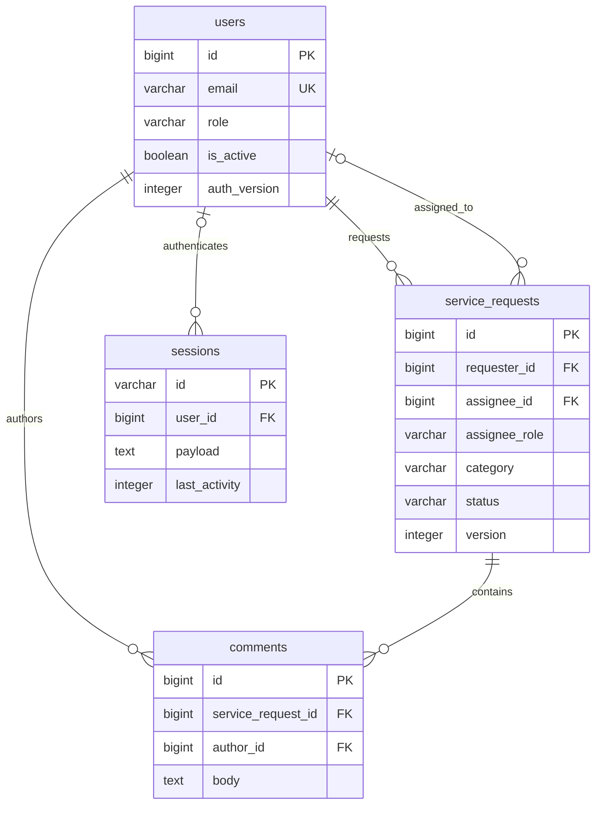

# DB 設計案

## 状態・参照

2026-09-22 作成。[要件](requirements.md)の FR-01～FR-09 を具体化する**レビュー対象の設計案**であり、migration・アプリ・DB テストは未実施です。今回指定されたデモ運用前提は [基本設計](architecture.md)に反映し、業務仕様の承認とは区別します。[API](api.md)、[画面](screens.md)、[対応表と設計レビュー](design-review.md)と合わせて参照してください。

## ER 図と責務

業務テーブルは `users`（初期利用者）、`service_requests`（依頼）、`comments`（追記）です。管理用の `sessions`、`cache`、`cache_locks`、`migrations`、`demo_seed_runs` は認証・制御・再現性のためだけに使い、業務画面へ公開しません。ユーザー管理、変更履歴、通知・queue、JWT / personal access token、パスワード再発行のテーブルは初期案に追加しません。

## 共通表現

| 対象 | 設計案・理由 |
| --- | --- |
| 業務 ID | PostgreSQL `bigint GENERATED BY DEFAULT AS IDENTITY`、正の値、PK。API は精度落ちを防ぐため数字文字列（例 `"101"`）、React も string。推測可能性は認可で防ぎ、ID を秘密情報にしない |
| 制御値 | `version` / `auth_version` は正の integer。API の version は JSON 整数。ID と混同しない。上限到達時は更新失敗・運用調査とし、循環させない |
| 時刻 | 業務日時は `timestamptz(6)`、接続・保存は UTC。API は `2026-09-22T03:00:00.000000Z` 形式、画面は Asia/Tokyo と明示。更新時刻はサーバーが設定し、競合判定に使わない |
| 役割 | `employee`＝社員、`it_staff`＝IT担当者。varchar + CHECK。1 人 1 役割、Web・通常運用で役割変更しない |
| 種別 | `inquiry`＝問い合わせ、`bug`＝不具合、`improvement`＝改善要望 |
| 状態 | `open`＝未対応、`in_progress`＝対応中、`waiting_confirmation`＝確認待ち、`completed`＝完了 |
| 列挙値 | PostgreSQL ENUM 型ではなく varchar + CHECK を提案。Laravel enum と画面ラベルも同じコードを使う。追加時に migration・API・画面を一緒に変更する |
| テキスト | UTF-8、長さはコードポイント（絵文字の見た目の文字数ではない）。前後 Unicode 空白を除去し空白だけを拒否。CRLF / CR は LF に統一、NUL と不正 UTF-8 は拒否。パスワードはこの加工から除外 |

以後、NULL「不可」は NOT NULL、既定「なし」は値の明示設定が必要という意味です。FK は特記以外 `ON UPDATE RESTRICT`、非遅延で検査します。CHECK は NULL を排除しないため、必須条件には NOT NULL を併用します。

## users

| カラム | 型 | NULL | 既定 | 制約・用途 |
| --- | --- | --- | --- | --- |
| id | bigint identity | 不可 | 自動採番 | PK、CHECK id > 0 |
| display_name | varchar(50) | 不可 | なし | CHECK char_length が 1～50。Laravel で空白だけを拒否 |
| email | varchar(254) | 不可 | なし | UNIQUE、CHECK 1～254、email = lower(btrim(email))、email ~ '^[!-~]+$'（空白なしASCII）。下記の正規化 |
| password | varchar(255) | 不可 | なし | Laravel のハッシュのみ。API・ログへ返さない |
| role | varchar(16) | 不可 | なし | CHECK employee / it_staff |
| is_active | boolean | 不可 | false | 管理投入の最終段階だけ true にする。停止しても過去の表示名を残す |
| auth_version | integer | 不可 | 1 | CHECK > 0。停止・全セッション失効時に加算 |
| created_at | timestamptz(6) | 不可 | CURRENT_TIMESTAMP | サーバー生成 |
| updated_at | timestamptz(6) | 不可 | CURRENT_TIMESTAMP | Laravel / 管理手順が更新。自動更新の DB トリガーは使わない |

`UNIQUE(id, role)` も設け、担当者の複合 FK の参照先にします。メールは初期投入とログインで同じ処理（前後空白除去 → ASCII の小文字化 → メール形式検証）を行います。デモアカウントは ASCII の `example.test` ドメインに限定する案です。国際化メール・メール到達性確認は対象外。DB の UNIQUE は正規化済み値に対して効かせ、重複は seed 全体をロールバックします。アプリの事前重複確認だけに依存しません。

パスワードは Laravel Hash の Argon2id を提案します（PHP 対応と負荷は未検証）。既存のログイン上限 128 コードポイントを bcrypt の byte 上限で黙って切り詰めないためです。初期資格情報は公開期間ごとに外部で生成する十分な長さのランダム値（案：20 文字以上）とし、Hash のコストは実機計測後に固定します。初期投入の再実行で再ハッシュ・上書きしません。remember me は提供せず `remember_token` は不要です。

## service_requests

| カラム | 型 | NULL | 既定 | 制約・用途 |
| --- | --- | --- | --- | --- |
| id | bigint identity | 不可 | 自動採番 | PK、CHECK > 0 |
| requester_id | bigint | 不可 | なし | FK users.id、ON DELETE RESTRICT。社員であることは Laravel が検査 |
| title | varchar(100) | 不可 | なし | CHECK 長さ 1～100、CR / LF を含まない |
| body | text | 不可 | なし | CHECK char_length が 1～5000 |
| category | varchar(16) | 不可 | なし | CHECK inquiry / bug / improvement |
| assignee_id | bigint | 可 | NULL | 下記複合 FK。未対応だけ NULL 可 |
| assignee_role | varchar(16) | 不可 | 'it_staff' | CHECK assignee_role = 'it_staff'。DB 内部の制約補助列、API 入出力に含めない |
| status | varchar(24) | 不可 | 'open' | CHECK open / in_progress / waiting_confirmation / completed |
| version | integer | 不可 | 1 | CHECK > 0。担当・状態が変わるたび +1 |
| created_at | timestamptz(6) | 不可 | CURRENT_TIMESTAMP | サーバー生成 |
| updated_at | timestamptz(6) | 不可 | CURRENT_TIMESTAMP | 担当・状態更新で変更。コメント投稿だけでは変更しない |

追加制約：`CHECK(status = 'open' OR assignee_id IS NOT NULL)` と `FOREIGN KEY(assignee_id, assignee_role) REFERENCES users(id, role) MATCH SIMPLE ON DELETE RESTRICT ON UPDATE RESTRICT` 相当です（DDL 構文は migration 工程で検証）。assignee_id が NULL のときだけ複合参照を省略し、非 NULL なら IT担当者しか指せません。補助列を置く理由は、他テーブルの role を CHECK の中で検索する誤った実装を避け、直接 SQL でも役割を保証するためです。Eloquent の関連自体は assignee_id で定義できます。

DB は「対応開始後の担当者あり」と「担当者の役割」を保証します。**状態の遷移順、現在操作中の利用者の権限、担当候補の有効性、完了後の不変性は Laravel の業務処理で保証**します。全依頼に CHECK を満たすだけではこれらを保証できません。停止した担当者を過去の依頼から消さず、未完了なら別の有効 IT担当者へ変更します。停止者が割り当てられたままの状態変更は 409 とする追加案です。

## comments

| カラム | 型 | NULL | 既定 | 制約・用途 |
| --- | --- | --- | --- | --- |
| id | bigint identity | 不可 | 自動採番 | PK、CHECK > 0 |
| service_request_id | bigint | 不可 | なし | FK service_requests.id、ON DELETE CASCADE。運用で親を削除したときのみ利用 |
| author_id | bigint | 不可 | なし | FK users.id、ON DELETE RESTRICT |
| body | text | 不可 | なし | CHECK char_length が 1～2000 |
| created_at | timestamptz(6) | 不可 | CURRENT_TIMESTAMP | サーバー生成。編集しないため updated_at なし |

投稿者が依頼者または IT担当者であること、親が完了していないことは親行ロック中に Laravel が検査します。投稿後の UPDATE / DELETE は Web の DB 権限にも与えない案です。

## 管理テーブル

Laravel 標準構成との照合は採用バージョン決定時に行います。以下は必要なカラムまで定義した案で、生成済み migration ではありません。

| テーブル | カラム（型 / NULL / 既定）・制約 | 用途・インデックス |
| --- | --- | --- |
| sessions | id varchar(255) PK / 不可 / なし、user_id bigint / 可 / NULL（users.id、削除 CASCADE）、ip_address varchar(45) / 可 / NULL、user_agent text / 可 / NULL、payload text / 不可 / なし、last_activity integer / 不可 / なし、CHECK last_activity >= 0 | database session。user_id と last_activity に index。未認証 CSRF 用セッションは user_id=NULL。IP / UA は原則記録しないよう保存処理を調整・検証し、必要性なしに個人情報を増やさない |
| cache | key varchar(255) PK / 不可 / なし、value text / 不可 / なし、expiration integer / 不可 / なし、CHECK expiration >= 0 | ログイン試行制限の共有 counter / timer 等。expiration index で期限切れ清掃。業務応答やパスワードを入れない |
| cache_locks | key varchar(255) PK / 不可 / なし、owner varchar(255) / 不可 / なし、expiration integer / 不可 / なし、CHECK expiration >= 0 | 同一セッションの要求直列化、試行制限の原子的判定。expiration index。owner は実行の識別子で認証主体ではない |
| migrations | id integer identity PK / 不可、migration varchar(255) / 不可 / なし、batch integer / 不可 / なし、CHECK batch > 0 | Laravel の schema 適用履歴。標準 migration repository との互換性を確認。アプリの認可判定には使わない |
| demo_seed_runs | id smallint PK / 不可 / 1、CHECK id=1、seed_version varchar(50) / 不可 / なし、publication_id varchar(64) / 不可 / なし、completed_at timestamptz(6) / 不可 / CURRENT_TIMESTAMP | DB ごとに成功した初期投入を 1 行だけ記録。Web の読み書き権限なし。秘密値・パスワードの比較値は保存しない |

セッションpayloadは認証情報として保護し、user_idに加えauthenticated_at・last_authenticated_activity_at（UTC UNIX秒）・認証時のauth_versionを保持します。Laravel標準のlast_activityとは別に、成功した保護要求の活動時刻と絶対期限を検査します。base64等の符号化を暗号化とみなしません。保存時暗号化は [基本設計](architecture.md)どおり。期限は [API設計](api.md)で定義し、期限切れ拒否と清掃を別処理にします。cache / lockの時刻もLaravel互換のUNIX秒であり、業務日時の例外です。公開中の定期清掃と終了時全削除を管理手順に含めます。

## 必要な追加インデックス

| 対象 | インデックス | 理由 |
| --- | --- | --- |
| users | (id, role) UNIQUE、email UNIQUE、(id) WHERE role='it_staff' AND is_active=true | 複合 FK、ログイン照合、有効な担当候補の ID 順ページング |
| service_requests | (created_at DESC, id DESC)、(requester_id, created_at DESC, id DESC) | IT担当者の全件と社員の本人一覧を 20 件ずつ取得 |
| service_requests | (assignee_id, assignee_role) | FK 参照側の検査・運用で担当者参照を探す |
| comments | (service_request_id, created_at ASC, id ASC)、(author_id) | 親ごとの 20 件ページング、投稿者の参照検査 |

PK / UNIQUE の自動生成 index は重複作成しません。FK の参照側 index は自動生成されると仮定しません。小規模デモでは全文検索・状態別 index は追加せず、実データと EXPLAIN で確認します。

## 認可・競合・トランザクション

書込は PostgreSQL READ COMMITTED、短いトランザクションを提案します（一覧のCOUNTと行取得はAPI文書のREAD ONLY / REPEATABLE READ）。RLSは初期案で導入せず、Policyと閲覧スコープを全APIで共有します。Web DB roleには業務3表のSELECT、依頼・コメントのINSERTと採番に必要な権限、依頼のassignee_id・status・version・updated_atの限定UPDATE、認証処理に必要な管理テーブル操作だけを許す案です。usersのINSERT・役割/パスワード/停止のUPDATE、業務DELETE、DDLは管理roleに分離します。

PostgreSQLのFOR SHAREにも対象表の少なくとも1列のUPDATE権限が必要なため、**users.updated_atだけのUPDATE権限**をWeb roleへ追加する案です。この列を認証・認可の判断に使わず、role・is_active・auth_version・passwordは更新できないことを権限テストで確認します。通常のログインで勝手にパスワード再ハッシュ更新を試みないよう認証処理も照合します。[SELECTのロック権限](https://www.postgresql.org/docs/current/sql-select.html)を参照。想定外のDB制約違反は500と安全な調査記録にし、成功や空結果に変換しません。

| 境界 | DB の保証 | Laravel / 管理処理の保証 |
| --- | --- | --- |
| アカウント | メール一意、型、役割コード | 同じ正規化、ハッシュ、is_active / auth_version、社員・IT の認可 |
| 担当 | IT 役割への複合 FK、対応開始後 NOT NULL | 候補が有効、解除は open のみ、completed は更新拒否 |
| 状態 | 値の集合、担当必須 | open → in_progress → waiting_confirmation → completed、waiting_confirmation → in_progress 以外拒否 |
| コメント | 親・投稿者存在、本文長 | 親の閲覧権、親行ロック後の completed 判定、投稿者を認証主体から設定 |
| 競合 | 行ロック、原子的 commit / rollback | 取得した version と一致を要求し、不一致 409。入力を再適用しない |

書込の順序は次のとおりです（すべての書込経路・管理処理で統一）。

1. API 共通処理で CSRF・認証・閲覧・操作権・入力を確認。セッションロック取得は DB 業務トランザクションより前。ハッシュ生成・ネットワーク呼出は親行ロックの外で行う。
2. transaction を開始し、操作する利用者と新規担当候補の users 行を **ID 昇順で FOR SHARE**。is_active・auth_version・role を再確認する。状態変更では事前読取した現担当者もこの組へ入れる。
3. 対象 service_requests の **1 行を FOR UPDATE** で取得し、閲覧権を再確認する。担当が事前読取から変わっていたら、新たな users 行を逆順に追加ロックせず 409 としてやり直す。外部入力で他人の行を自由にロックできないよう事前スコープを通す。
4. 担当・状態変更は `expected_version` と version を比較（不一致なら 409）、その後状態・候補を再検査。更新し version +1、updated_at 更新。同じ担当への変更・同じ状態は 409。成功応答は commit 後に返す。
5. コメントは **expected_version を要求しない**。親の completed をロック後に検査してから INSERT。親の version / updated_at は変更しない。コメント同士は追記であり上書き競合がないためで、一覧順もコメント時刻では変わらない。

コメントが先に親をロックすると投稿 commit の後に完了でき、完了が先なら待機後の投稿は 409 です。INSERT だけをロックして親の状態を先に読む方式は使いません。DB transaction 内の HTTP 呼出・UI 待ちは禁止。ロック待ち・deadlock は rollback を確認し 503（再確認を促す）へ変換する案です。アプリやクライアントが不明な書込結果を自動再送しません。

アカウント停止は管理処理が users を同じ ID 順で FOR UPDATE、is_active=false・auth_version +1 とし、その利用者の sessions を削除します。停止前に共有ロックを取った書込の終了を待ち、停止 commit 後の書込は拒否します。セッション保存の遅延で古い行が復活しても auth_version 不一致を拒否するため、行削除だけに頼りません。公開終了時は先に入口閉鎖・処理の drain を行い、全アカウントに同処理を適用します。

## 管理手順とデータの寿命

| ID | 目的 | 実行条件と結果 |
| --- | --- | --- |
| OPS-01 | 通常 migration / 再デプロイ | 同じ公開期間の DB を維持して差分適用。事前確認・必要な snapshot・`migrate --force`。seed 自動実行・`migrate:fresh` 禁止 |
| OPS-02 | FR-09 初期投入 | demo 用途、許可 account / DB、publication_id、明示許可を照合。管理専用ジョブで排他実行。トランザクション内で demo_seed_runs を含む対象テーブルを固定順に排他ロックし、未投入かつ業務 3 表が空の場合のみ全件作成・完了記録を一括 commit |
| OPS-03 | 同一投入の再実行 | 前提照合後、同じ publication_id / seed_version の成功記録があれば **no-op**。利用者の追記・停止・資格情報を上書きしない。違う記録、記録なしの非空 DB は非 0 終了。失敗は全体 rollback、途中成功扱いしない |
| OPS-04 | 公開終了・失効・保存 | 作成者が閉鎖と drain を確認 → 全利用者停止・auth_version 更新・全 sessions / cache / cache_locks を削除 → デモ資格情報を配布停止・ローテーション → snapshot 作成と Available 確認 → runtime 撤去。単なる secret の削除を DB パスワード失効の代わりにしない |
| OPS-05 | 次回公開の初期化 | 前期間の DB を使い回さず、新規の空 DB へ通常 migration → 新 publication_id・新資格情報で OPS-02。旧 snapshot を戻して seed で上書きしない。ID は再利用され得るので旧 URL / ブラウザー状態を引き継がない |
| OPS-06 | 障害復元・復元検証 | 同期間の障害対応または隔離検証だけ snapshot から別 DB へ復元。入口を閉じ全 sessions を破棄、auth_version を更新し、旧デモ資格情報をローテーション。schema・件数・認可確認後、再公開するときだけ利用者を明示的に有効化。seed を再実行して欠損補修しない |
| OPS-07 | 期限削除・誤投入対応 | 削除と結果確認の責任者は作成者。下記方針に沿って live DB・snapshot・ログ・キャッシュの残存を確認し、秘密値なしの結果を記録 |

初期投入は社員 A・B、IT担当者 X・Y と 3 種別・4 状態を網羅する架空依頼 4 件以上・コメントを含みます。ハッシュと role / 所有者は安全な入力・固定 fixture から生成し、クライアント JSON を投入しません。APP_ENV=production / APP_DEBUG=false と demo 用途は別条件です。seed の補助列や制約を無効化して fixture を通しません。

期間内再デプロイでは保持、次回公開は新規初期データ、snapshot は**取得後 7 日間・通常最新 1 世代**、アプリログ 7 日・アクセスログ 30 日を今回の前提とします。「7 日」は各 snapshot の取得完了時刻から計算し、コピー・復元で寿命を延ばしません。新 snapshot の復元検証中だけ旧世代と一時併存し、検証後に旧世代を削除。ただし旧世代も元の 7 日期限を超えず、検証が間に合わなければ作成者が復元未確認を記録して期限内に削除・再検証計画を立てます。バックアップ予算枠 20 GB-month は当面維持します。

運用上の依頼削除は親削除とコメント CASCADE を同一 transaction で実施。コメントだけの機密誤投入なら管理 role による対象コメントの削除を別途記録します。利用者は原則停止して参照を保持し、物理削除が必要なら関連依頼・コメントを調査して子から削除（FK RESTRICT を解除しない）。公開終了後の通常データ廃棄は DB と snapshot の期限削除で行い、state / 復元鍵を一括削除しません。

秘密情報の誤投入は 7 日 / 30 日の期限を待たず、入口制限、該当認証情報の失効、影響範囲調査、汚染した live データ・snapshot・ログの除去を作成者が実施します。snapshot の部分編集はできないため汚染 snapshot を復元元から外し削除します。失効・漏えい対応をデータ削除だけで完了にしません。

## 根拠と未検証事項

2026-09-22 に [PostgreSQL 制約](https://www.postgresql.org/docs/current/ddl-constraints.html)、[行ロック](https://www.postgresql.org/docs/current/explicit-locking.html)、[分離レベル](https://www.postgresql.org/docs/current/transaction-iso.html)、[Laravel Session](https://laravel.com/docs/13.x/session)、[Cache](https://laravel.com/docs/13.x/cache)、[Hashing](https://laravel.com/docs/13.x/hashing)を参照しました。文書の参照版は製品の採用バージョン確定を意味しません。独自の列・制約・タイムアウトは本サービスの提案です。

実 PostgreSQL での FK / CHECK / UNIQUE、2 接続による競合・commit 順、session 保存と停止、database cache lock、rollback の検証は [横断検証計画](design-review.md)に分離しました。SQLite の単体テストで同等とみなさず、すべて今後実施します。
